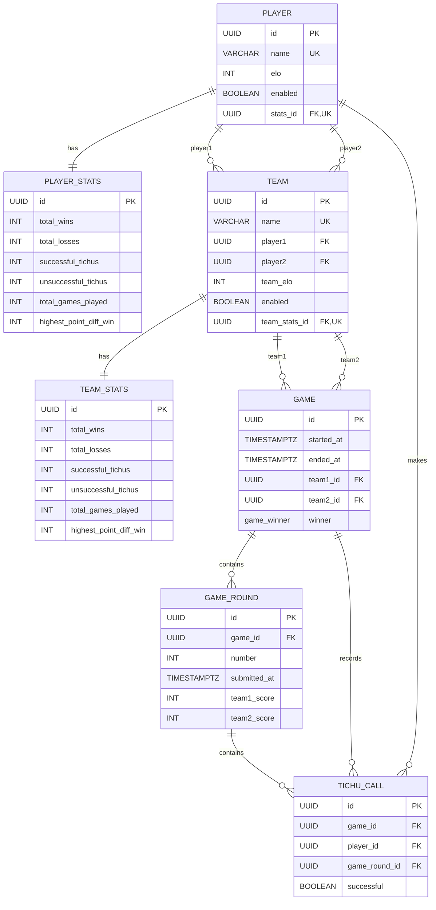

# Tichu Backend Database

## Constraints

- Teams contain two distinct players.
- Games contain two distinct teams.
- A game contains multiple rounds.
- A round can contain multiple Tichu calls.
- A player can make only one Tichu call per round.
- A completed game has a winner and an end timestamp.
- Every player references exactly one player stats row.
- Every team references exactly one team stats row.
- Player and player-stats IDs are identical.
- Team and team-stats IDs are identical.
